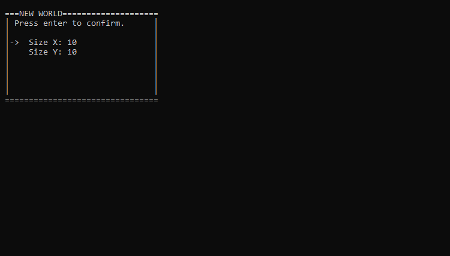
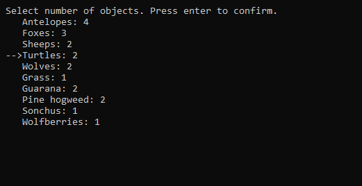
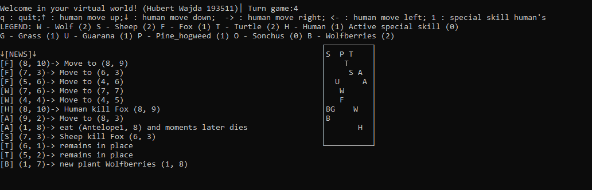
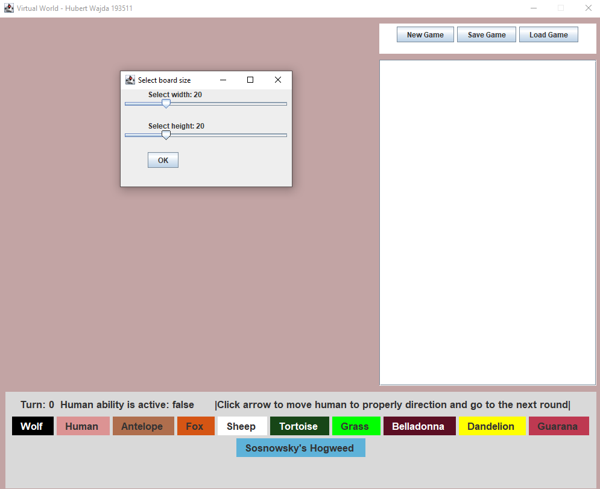
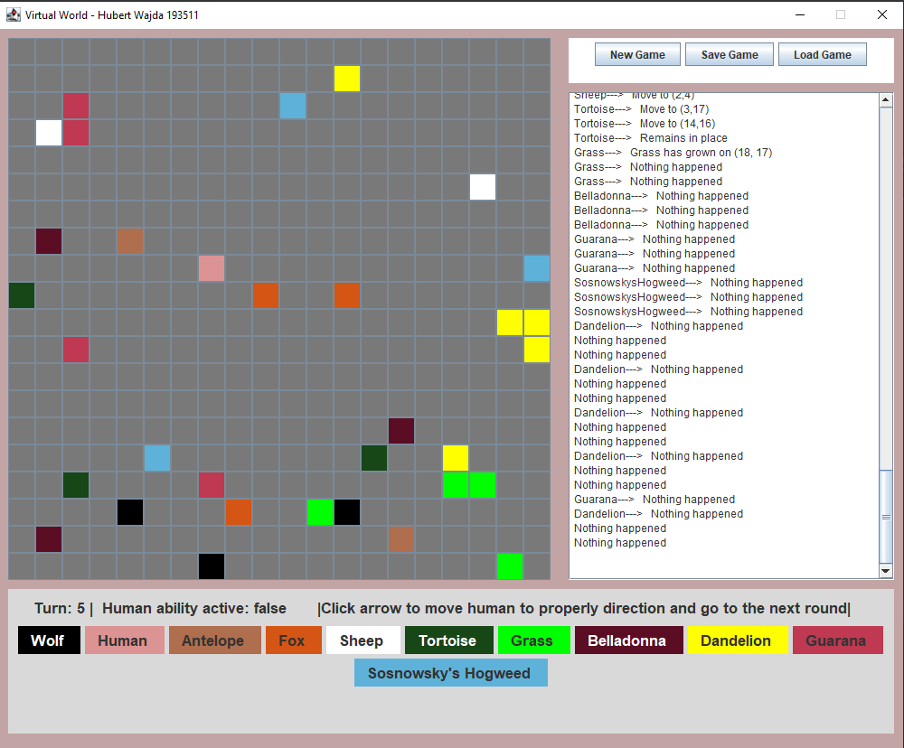
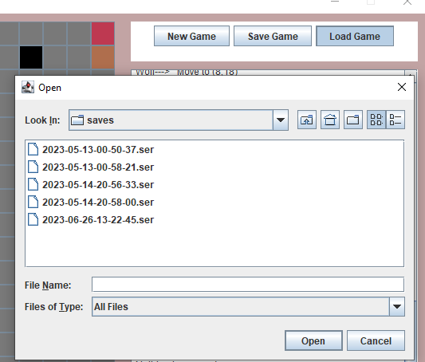
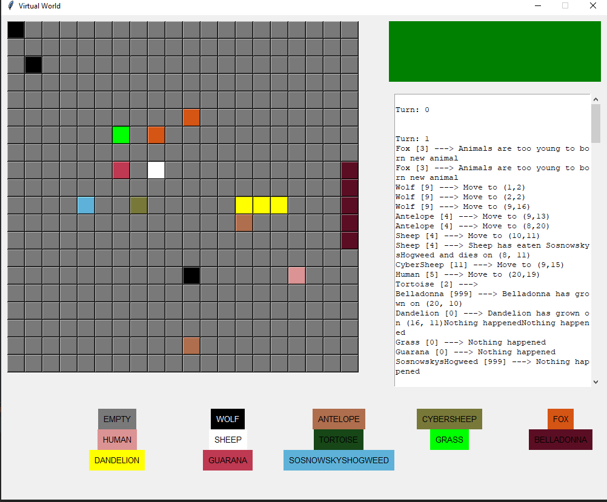
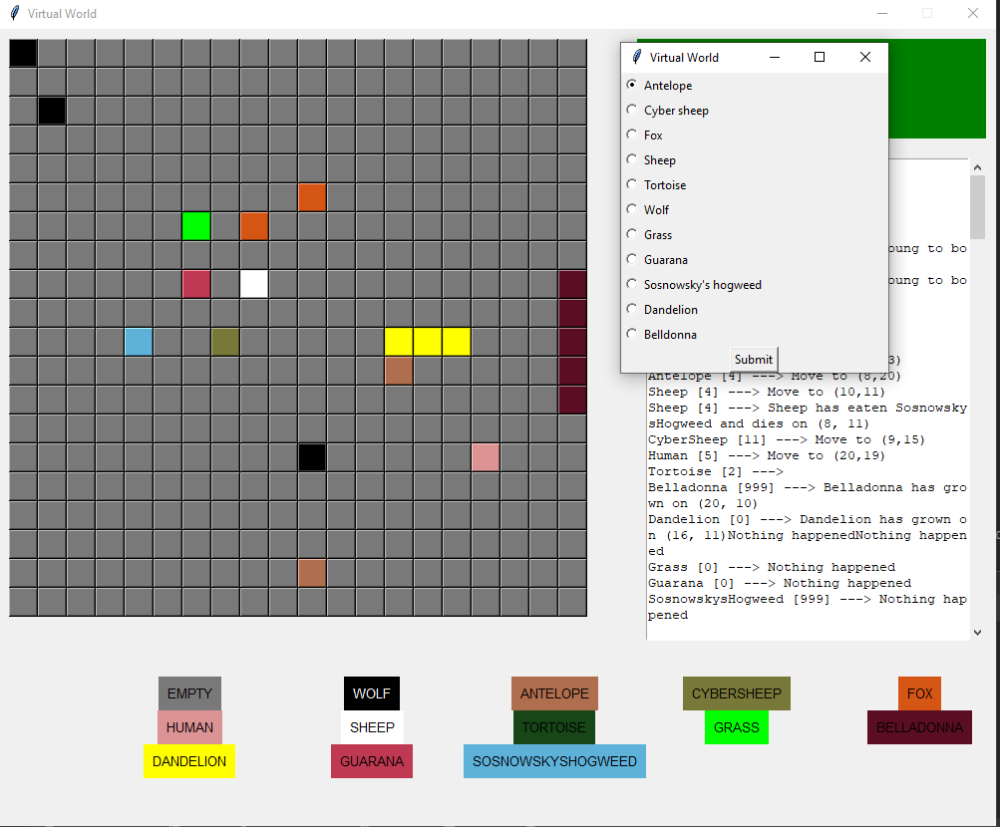

# Virtual_world

The aim of the project is to implement a program with the character of a virtual world simulator, which is to have the structure of a two-dimensional lattice of any user-specified size NxM. 
This world instances simple life forms with distinct behavior. Each organism occupies exactly one field in the array, 
and there can be at most one organism in each field (in case of a collision, one of them should be removed or moved). The simulator is turn-based. 
In each turn, all organisms existing in the world perform an action appropriate to their type. Some of them move (animal organisms), 
some will be stationary (plant organisms). In the event of a collision (one of the organisms will be on the same field as another), 
one of the organisms wins, killing (e.g. a wolf) or chasing away (e.g. a turtle) the competitor (when colliding with an organism of the same species, 
there is no fight, both animals remain in their places, a third animal, of the same species, appears next to them). 
The order of movement of organisms in a turn depends on their initiative. The animals with the highest initiative move first. 
In the case of animals with the same initiative, the order is determined by the seniority rule (the longer-lived one moves first). 
Victory in an encounter depends on the strength of the organism, although there will be exceptions to this rule. At equal strength, 
the organism that attacked wins. The program window contains a field where information about the results of battles,
consumption of plants and other events occurring in the world are written out.

A specific type of animal is to be Human. Unlike animals, man does not move randomly. 
The direction of his movement is determined before the start of the turn by using the arrow keys on the keyboard. 
Man also has a special skill that can be activated with a separate button. The activated skill remains active for 5 consecutive turns, 
after which it is deactivated. Once deactivated, the skill cannot be activated until 5 consecutive turns have passed.
It has no intelligence of its own (it is controlled by the player) and does not reproduce (the player will be the only Man on the map).
animal force initiative specifics of the action() method specifics of the collision() method.

Animal:
* each typical animal in its turn
moves to a randomly selected adjacent field.
* when colliding with an organism of the same species
there is no fight, both animals remain in their places, next to them appears a
a third animal, of the same species.

| Animal       | Force | Initiative |                                                         specifics of the action()                                                          |                                                                 specifics of the collision()                                                                  |
|:-------------|:-----:|:----------:|:------------------------------------------------------------------------------------------------------------------------------------------:|:-------------------------------------------------------------------------------------------------------------------------------------------------------------:|
| Antelope     |   4   |     4      |                                                     The range of movement is 2 fields.                                                     |                                      50% chance to escape before the fight. Then moves to an unoccupied adjacent field.                                       |
| Wolf         |   9   |     5      |                                                                  lack of                                                                   |                                                                            lack of                                                                            |
| Fox          |   3   |     7      |                 Good sense of smell: the fox will never move to a field occupied by an organism organism stronger than it.                 |                                                                            lack of                                                                            |
| Sheep        |   4   |     4      |                                                                  lack of                                                                   |                                                                            lack of                                                                            |
| Tortois      |   2   |     1      |                                             In 75% of cases, it does not Changes its position.                                             |                                 Repels attacks from animals with strength <5. The attacker must Return to its previous field.                                 |
| Human        |   5   |     4      |             The direction of his movement is determined before the start of the turn by using the arrow keys on the keyboard.              | Man's Strength increases to 10 in the first turn of the skill's activity. In each subsequent turn, it decreases by "1" until it returns to its initial state. |
| Cyber-sheep  |  11   |     4      | He always heads towards the nearestSosnowsky's Hogweed and tries to eat it. If there is no borscht then he pretends to be an ordinary sheep |                                                                  It eats Sosnowsky hogweed.                                                                   |

Plant:
* with some probability probability each plant can "seed" a new plant of the same species in a random neighboring field.

| Plant               | Force |                       specifics of the action()                        |                            specifics of the collision()                            |
|:--------------------|:-----:|:----------------------------------------------------------------------:|:----------------------------------------------------------------------------------:|
| Belladonna          |   0   |                   The range of movement is 2 fields.                   | 50% chance to escape before the fight. Then moves to an unoccupied adjacent field. |
| Dandelion           |  99   |           It makes three attempts spread in one round round.           |                                      lack of                                       |
| Grass               |   0   |                                lack of                                 |                                      lack of                                       |
| Guarana             |   0   |                                lack of                                 |      Increases the strength of of the animal that has eaten this plant, by 3.      |
| Sosnowsky's Hogweed |  99   | It kills all animals in its neighborhood except for the cyber-animals. |         The animal that ate this plant dies. Only cyber-animal is immune.          |

# Preview

